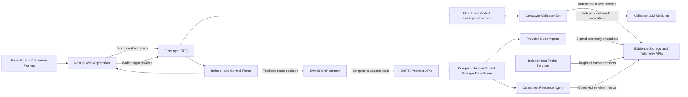

# OmniNode Architecture Blueprint

**Project:** OmniNode Universal DePIN Router  
**Role:** Principal Web3 Architect  
**Phase:** Architecture Design and Technical Specification  
**Status:** Proposed architecture for review  
**Implementation status:** No implementation source files are required for this phase

## 1. Executive Summary

OmniNode is a decentralized resource switching platform for DePIN networks. It routes consumers between providers of compute, bandwidth, and storage according to real-time evidence, predefined service policies, provider economics, and switching risk.

The core architectural decision is that OmniNode is a **consensus-backed control, verification, and settlement plane**, not a proxy for resource traffic. Compute workloads, storage payloads, and bandwidth traffic remain in the DePIN data plane. GenLayer decides which provider is eligible, whether evidence satisfies the service-level agreement, when a switch is justified, and how escrow is settled.

GenLayer Intelligent Contracts provide the authoritative state transition for decisions that require external evidence and judgment. Next.js provides the user interface and wallet integration. Off-chain services collect telemetry, index finalized state, and execute already-finalized switch instructions through provider-specific adapters.

## 2. Goals And Non-Goals

### Goals

- Register and manage DePIN resource providers.
- Accept consumer resource requests with explicit requirements and service policies.
- Evaluate provider availability and quality using independent evidence.
- Select the best eligible provider through GenLayer consensus.
- Switch resources through idempotent off-chain adapters after finality.
- Verify activation and service checkpoints through additional consensus-backed transactions.
- Settle provider payments, consumer refunds, and penalties through deterministic escrow logic.
- Support compute, bandwidth, and storage with a shared protocol model.
- Preserve an auditable trail of evidence, decisions, transaction hashes, and settlement outcomes.

### Non-Goals

- Carrying compute jobs, packets, or storage payloads through GenLayer.
- Storing high-frequency telemetry samples on-chain.
- Calling side-effectful provider APIs from Intelligent Contract nondeterministic blocks.
- Allowing an off-chain orchestrator, indexer, provider, or consumer to decide settlement alone.
- Treating one provider-signed telemetry report as independent proof.
- Using an LLM for authorization, balance calculations, money arithmetic, or fixed threshold checks.

## 3. System Architecture

### High-Level Topology



### Control Plane And Data Plane

| Plane | Responsibilities |
| --- | --- |
| GenLayer control plane | Node eligibility, evidence adjudication, route selection, switch authorization, SLA outcomes, reputation summaries, and escrow accounting |
| Off-chain control plane | Indexing, candidate discovery, transaction automation, evidence publication, and finalized-event monitoring |
| Resource data plane | Workload execution, packet forwarding, storage reads and writes, replication, and provider-specific provisioning |
| User interface | Wallet interaction, request creation, transaction lifecycle display, route visualization, escrow dashboards, and SLA dashboards |

GenLayer must not handle resource payloads. Large files, compute jobs, network packets, API credentials, and raw high-frequency telemetry remain off-chain.

### Deployment Units

The initial system has four deployable units:

| Unit | Purpose |
| --- | --- |
| Next.js web application | Consumer and provider dashboards, wallet writes, and finalized-state reads |
| `OmniNodeMarket` Intelligent Contract | Authoritative registry, request market, routing decisions, SLA outcomes, and escrow ledger |
| Control-plane service | Indexer, automation triggers, evidence storage, and optional managed orchestrator |
| Node and switch agents | Provider telemetry collection and consumer-side resource actuation |

The control-plane service is operationally useful but not authoritative. It may trigger an evaluation, cache state, or execute a finalized decision, but it cannot determine the winner or release funds.

### System Boundaries

| Component | Authoritative Responsibilities | Non-Authoritative Responsibilities |
| --- | --- | --- |
| Next.js application | User-signed intent | Presentation, validation previews, filtering, and local status |
| GenLayer contract | Registry state, decisions, escrow, SLA outcomes, and reputation state | None |
| GenLayer validators | Independent evidence interpretation and equivalence voting | None |
| Indexer | None | Search, history, analytics, and denormalized views |
| Automation worker | None | Submit eligible checkpoint or evaluation transactions |
| Provider node agent | None | Signed provider telemetry and challenge responses |
| Independent probes | None | Regional observations and active challenge results |
| Consumer agent | None | Consumer-path measurements and finalized switch execution |
| Switch orchestrator | None | Execution of an already finalized route decision |
| Evidence storage | None | Retention and retrieval of immutable evidence bytes |

## 4. Next.js And GenLayer Interaction

The Next.js application does not call a Python HTTP server. The Python Intelligent Contract is deployed into GenVM and exposes public methods through the GenLayer contract schema.

### Read Flow

1. A read-only `genlayer-js` client connects to the configured GenLayer network.
2. Server Components and browser queries use `readContract` for authoritative contract state.
3. Latest non-final state may be used for responsive previews, but finalized state must be used for financial and operational conclusions.
4. The indexer provides efficient historical queries, search, charts, and pagination.
5. Direct contract reads remain the source of truth when the indexer and chain disagree.

### Write Flow

1. A user connects a browser wallet.
2. The browser creates a write client with the wallet address and provider.
3. The application calls `client.connect()` before writes to ensure the wallet is on the expected GenLayer network.
4. `writeContract` serializes the method name and arguments and submits the transaction.
5. The UI monitors `PENDING`, `ACCEPTED`, and `FINALIZED` lifecycle states.
6. `ACCEPTED` is displayed as provisional because it remains appealable.
7. Normal resource switching and payment execution wait for `FINALIZED`.
8. The UI inspects the receipt execution result. A transaction reaching `ACCEPTED` or `FINALIZED` does not by itself prove that contract execution succeeded.

Example interaction shape:

```typescript
import { createClient } from "genlayer-js";
import { testnetBradbury } from "genlayer-js/chains";
import { TransactionStatus } from "genlayer-js/types";

const readClient = createClient({
  chain: testnetBradbury,
});

const writeClient = createClient({
  chain: testnetBradbury,
  account: walletAddress,
  provider: window.ethereum,
});

await writeClient.connect("testnetBradbury");

const txHash = await writeClient.writeContract({
  address: marketAddress,
  functionName: "create_request",
  args: [requestPayload],
  value: escrowAmountWei,
});

const receipt = await readClient.waitForTransactionReceipt({
  hash: txHash,
  status: TransactionStatus.FINALIZED,
});
```

The exact SDK version, network name, and method signatures must be pinned during implementation. The example is an integration shape, not a final generated contract client.

Wallet private keys remain in the wallet. Server-side Next.js code uses a read-only client and must not hold consumer or provider signing keys.

## 5. Domain Model

### Core Records

| Record | Key Fields |
| --- | --- |
| `NodeProfile` | Node ID, owner, payout address, resource type, region, capability profile, telemetry URL, profile version, price, stake, and status |
| `ResourceRequest` | Request ID, consumer, resource requirements, SLA policy, budget, duration, offer deadline, and status |
| `ProviderOffer` | Request ID, node ID, quoted price, capacity reservation reference, expiry, and profile version |
| `EvidenceManifest` | Manifest ID, schema version, node ID, sequence, observed time, expiry, metric reports, challenge receipts, source identities, and digest |
| `RouteDecision` | Request or lease ID, revision, action, selected node, eligible nodes, score bands, evidence digest, and reason codes |
| `Lease` | Lease ID, consumer, active node, standby nodes, epoch, start time, status, and remaining escrow |
| `Checkpoint` | Lease ID, epoch, evidence digest, quality outcome, payment outcome, and settlement status |
| `CreditBalance` | Account, withdrawable amount, and withdrawal nonce |
| `PolicyVersion` | Metric definitions, tolerances, weights, freshness limits, switch hysteresis, and prompt hash |

### Node States

```text
UNVERIFIED -> ACTIVE -> DEGRADED -> SUSPENDED -> EXITING -> EXITED
```

### Lease States

```text
REQUESTED
  -> OFFERING
  -> ROUTE_EVALUATION
  -> ROUTE_SELECTED
  -> ACTIVATING
  -> ACTIVE
  -> CHECKPOINT_DUE
  -> COMPLETED

ACTIVE
  -> SWITCH_EVALUATION
  -> ACTIVATING
  -> ACTIVE

REQUESTED or OFFERING
  -> CANCELLED or EXPIRED

ACTIVATING or ACTIVE
  -> PAUSED or REFUNDING
```

These product states must not be confused with GenLayer transaction states. A lease may show `ROUTE_SELECTED` in latest accepted state while the transaction itself is still inside the appeal window.

## 6. Resource Types

OmniNode uses a shared node, offer, evidence, route, and settlement model for three resource types.

### 6.1 Compute

**Hard capabilities:**

- CPU architecture and instruction set.
- CPU core count and memory in MiB.
- Accelerator model and accelerator memory.
- Supported runtime, container, and operating system versions.
- Region and availability zone.
- Maximum job duration and concurrency.

**Quality metrics:**

- Job success rate.
- Benchmark score.
- Queue time.
- P95 execution latency.
- Thermal throttling rate.
- Crash and restart rate.

**Switch workflow:**

1. Reserve target capacity.
2. Deploy or restore the workload.
3. Execute a health and compatibility challenge.
4. Verify readiness.
5. Move new work to the target.
6. Drain the source.
7. Publish an activation receipt.
8. Verify the activation through GenLayer.

### 6.2 Bandwidth

**Hard capabilities:**

- Supported regions.
- Committed Mbps.
- Protocol and tunnel support.
- Transfer limits.
- Routing or peering capabilities.

**Quality metrics:**

- Throughput.
- Packet loss in parts per million.
- Jitter in microseconds.
- P95 latency by measurement region.
- Route stability.
- Availability over the checkpoint interval.

**Switch workflow:**

1. Prepare the target tunnel or route.
2. Validate the path from independent regions.
3. Update forwarding or routing policy.
4. Monitor loss, latency, and jitter.
5. Drain the previous path only after the target is healthy.
6. Publish an execution receipt.
7. Verify and settle the checkpoint.

Validator HTTP latency must not be treated as consumer-path latency. Regional probes and consumer-side observations must include their measurement origins.

### 6.3 Storage

**Hard capabilities:**

- Capacity in bytes.
- Access protocol.
- Redundancy class.
- Encryption support.
- Replication and consistency capabilities.
- Availability regions.

**Quality metrics:**

- Read latency.
- Write latency.
- IOPS.
- Integrity challenge success.
- Retrieval success.
- Replication health.
- Recovery point and recovery time behavior.

**Switch workflow:**

1. Begin replication to the target.
2. Verify content integrity.
3. Reach the configured consistency threshold.
4. Switch reads.
5. Switch writes when the target is safe.
6. Monitor post-switch retrieval and integrity.
7. Retire the source only after the retention policy is satisfied.
8. Verify the activation and settle the checkpoint.

## 7. Intelligent Contract Design

### Recommended Contract Topology

Version 1 should deploy one `OmniNodeMarket` Intelligent Contract containing the registry, request market, route state, reputation summaries, and escrow ledger.

This is preferable to separate registry, router, and escrow contracts initially because Intelligent Contract writes across contracts are asynchronous. Splitting transaction-critical state too early creates message ordering, duplicate delivery, and partial settlement risks.

Markets may be sharded by resource class or region after load and consistency requirements are measured.

### Storage Model

Use GenLayer storage types rather than ordinary Python containers:

- `TreeMap` for keyed records and indexes.
- `DynArray` for append-only IDs and bounded history.
- `u256` for balances, prices, counters, and fixed-point values.
- Storage-allowed dataclasses or serialized JSON strings for structured records, depending on the selected SDK generation.
- Integer basis points for scores and percentages.

Storage fields are declared with class-level type annotations. New fields must be appended rather than inserted if the contract is ever upgraded.

### Node Functions

| Function | Behavior |
| --- | --- |
| `register_node` | Registers a unique node, validates the bounded profile, receives collateral, and creates an `UNVERIFIED` record |
| `update_node_profile` | Updates mutable metadata and increments the profile version while preserving owner and liability fields |
| `set_node_availability` | Lets the owner stop accepting new offers without escaping active lease obligations |
| `verify_node` | Fetches public evidence, evaluates capabilities and availability through consensus, and changes node status |
| `request_node_exit` | Prevents new offers and starts an exit cooldown |
| `withdraw_node_stake` | Releases unused collateral only after cooldown and after all lease liabilities are cleared |
| `get_node` | Returns one bounded node record |
| `list_node_ids` | Returns paginated node IDs rather than an unbounded registry |

`register_node` is deterministic. AI is not used merely to store a provider claim. `verify_node` is the operation that adjudicates evidence.

### Request Functions

| Function | Behavior |
| --- | --- |
| `create_request` | Receives escrow, stores canonical requirements and SLA terms, and opens the offer window |
| `submit_offer` | Records a provider offer from the node owner and locks the relevant profile and price versions |
| `cancel_request` | Cancels only while cancellation is allowed and credits the refundable balance |
| `expire_request` | Permissionlessly expires a request after its deadline |
| `evaluate_route` | Evaluates a bounded candidate set and records `ROUTE`, `NO_ROUTE`, or `INCONCLUSIVE` |
| `get_request` | Returns the request and current route summary |
| `list_offer_ids` | Returns bounded and paginated offer identifiers |

Version 1 caps the evaluated candidate set, initially at eight candidates. Evaluating every registered node through LLM and web calls would be expensive, slow, and vulnerable to denial of service.

Provider offers should be submitted on-chain or committed through a contract-recognized mechanism. An off-chain indexer can discover candidates but must not have unilateral authority to omit competitors.

### Activation Functions

| Function | Behavior |
| --- | --- |
| `submit_activation_receipt` | Records a bounded, content-addressed claim that the finalized route was prepared |
| `verify_activation` | Independently checks the activation evidence and transitions the lease to `ACTIVE` or failure handling |
| `record_execution_failure` | Records an actuator failure without allowing the actuator to decide settlement |
| `get_route_decision` | Returns the selected node, revision, evidence digest, and decision status |

An orchestrator claim cannot make a route active by itself. Activation requires a second evidence-backed verification transaction.

### Checkpoint Functions

| Function | Behavior |
| --- | --- |
| `evaluate_checkpoint` | Classifies the current service epoch as `PASS`, `DEGRADED`, `FAIL`, or `INCONCLUSIVE` |
| `evaluate_switch` | Compares the current route against eligible alternatives and returns `KEEP`, `SWITCH`, `PAUSE`, or `TERMINATE` |
| `ratify_emergency_switch` | Evaluates a switch already performed under a pre-authorized emergency policy |
| `complete_lease` | Closes a fully settled lease |
| `claim_timeout` | Applies a deterministic timeout policy if activation or evidence delivery never occurs |

`evaluate_checkpoint` determines the SLA class. Payment arithmetic remains deterministic and uses the SLA table pinned when the request was created.

### Escrow Functions

| Function | Behavior |
| --- | --- |
| `fund_request` | Adds GEN to a request when additional authorized funding is needed |
| `credit_checkpoint` | Internal deterministic operation that allocates an epoch payment or refund |
| `apply_penalty` | Internal deterministic operation that moves an allowed amount of stake into consumer credit |
| `claim_credit` | Lets a provider or consumer withdraw its own finalized credit |
| `get_escrow` | Returns locked, allocated, refunded, and claimed amounts |
| `get_credit` | Returns the caller's withdrawable balance |

Version 1 uses native GEN:

- Amounts are stored as `u256` in wei.
- Floating-point values are forbidden for monetary calculations.
- The payable request method checks `gl.message.value`.
- The contract maintains an internal ledger because the contract balance aggregates many users.
- Transfers to payout accounts are emitted only on finalization.
- Stablecoin settlement is a later EVM escrow integration with its own cross-layer threat model.

### Administrative Functions

| Function | Constraint |
| --- | --- |
| `pause_new_requests` | May stop new activity but must not block refunds or credit withdrawals |
| `set_policy_version` | Applies only to future requests unless all affected parties explicitly accept the change |
| `set_automation_account` | Grants permission to trigger work, never permission to select outcomes |
| `transfer_administration` | Requires a controlled governance or multisignature process |

An administrator must not be able to seize escrow, rewrite finalized decisions, or silently alter an existing SLA.

### Events

The contract should emit events such as:

- `NodeRegistered`
- `NodeStatusChanged`
- `RequestCreated`
- `OfferSubmitted`
- `RouteDecisionRecorded`
- `ActivationVerified`
- `SwitchDecisionRecorded`
- `CheckpointSettled`
- `CreditAvailable`
- `CreditClaimed`
- `LeaseClosed`

Events are indexing hints. The indexer must retain the transaction hash and consensus status and reconcile provisional events against final state.

## 8. Resource And Evidence Schema

### Common Metric Rules

- Every schema has an explicit integer version.
- All metric names and enum values are ASCII English.
- All numeric measurements use integers and declared units.
- Time values use Unix seconds or canonical UTC ISO 8601.
- Every snapshot includes a monotonically increasing sequence.
- Every snapshot includes `observed_at` and `expires_at`.
- Every snapshot is content-addressed with a cryptographic digest.
- Every source report identifies its reporter and measurement region.
- URLs use HTTPS and must not contain secrets.
- Payload sizes, redirect counts, and response times are bounded.
- Full logs remain off-chain.
- Evidence remains available through the appeal and settlement retention period.

### Evidence Sources

A production route decision should use at least:

1. A provider-signed resource snapshot.
2. A consumer or workload-side observation when an existing service is being evaluated.
3. One or more independent regional probe reports.
4. An active challenge result where technically possible.
5. A public capability or attestation document when compatibility requires interpretation.

Examples of active challenges include compute benchmark jobs, storage integrity and retrieval challenges, and bandwidth tests from an identified probe region.

### Canonical Evidence Manifest

The first protocol version should define a bounded manifest similar to:

```json
{
  "schema_version": 1,
  "manifest_id": "manifest-identifier",
  "lease_id": "lease-identifier",
  "node_id": "node-identifier",
  "node_profile_version": 3,
  "sequence": 42,
  "observed_at": 1700000000,
  "expires_at": 1700000060,
  "resource_type": "compute",
  "reports": [
    {
      "source_type": "independent_probe",
      "source_id": "probe-region-a",
      "region": "region-a",
      "metrics": {
        "availability_bps": 10000,
        "latency_us_p95": 12000,
        "job_success_bps": 9975
      },
      "content_digest": "sha256-digest",
      "signature": "domain-separated-signature"
    }
  ],
  "manifest_digest": "canonical-manifest-digest"
}
```

The exact schema, signature scheme, maximum fields, and canonicalization rules must be versioned in `packages/protocol` before contract implementation.

## 9. Routing Algorithm

The routing decision follows this order:

1. Validate request state, caller permissions, escrow, deadlines, schema versions, and candidate count deterministically.
2. Reject suspended nodes, mismatched resource types, expired offers, insufficient stake, and prices above the request maximum.
3. Fetch immutable evidence manifests inside a nondeterministic execution block.
4. Verify evidence digests and extract bounded fields.
5. Fetch live corroborating status only from approved, side-effect-free endpoints.
6. Apply hard SLA gates before asking an LLM to rank candidates.
7. Use the LLM to interpret heterogeneous capability claims, conflicting reports, compatibility descriptions, and evidence credibility.
8. Require validators to independently repeat or substantively verify the assessment.
9. Compute the final weighted rank with integer basis-point scores.
10. Require a minimum winner margin or return `INCONCLUSIVE`.
11. Record the route decision only after the nondeterministic block returns.
12. Leave all payment arithmetic and state writes in deterministic execution.

### Route Score

The normalized score is `0` through `10000` basis points with request-pinned weights:

| Dimension | Meaning |
| --- | --- |
| Capability | Match against required hardware, protocols, capacity, and region |
| Quality | Current availability, throughput, latency, integrity, or benchmark performance |
| Reliability | Historical verified checkpoints and independent evidence consistency |
| Cost | Price relative to the request ceiling |
| Switching risk | Migration cost, warm-up time, replication lag, or route disruption risk |

The contract must not let an LLM perform money arithmetic or invent weights.

Deterministic tie-breaking:

1. Higher eligibility and SLA class.
2. Higher total score.
3. Lower quoted price.
4. Higher verified reliability.
5. Lexicographically smaller ASCII node ID.

## 10. AI And Consensus Role

### What AI Decides

AI is appropriate for:

- Mapping provider-specific capability descriptions into the normalized resource model.
- Judging whether heterogeneous evidence is mutually consistent.
- Distinguishing genuine degradation from an expected temporary variation.
- Assessing semantic compatibility between a workload requirement and a provider capability.
- Classifying conflicting or incomplete evidence as acceptable, degraded, failed, or inconclusive.
- Comparing a current provider against alternatives when several qualitative factors interact.

AI is not appropriate for:

- Authorization checks.
- Balance calculations.
- Timestamp arithmetic.
- Price ceilings.
- Escrow allocation.
- Candidate count limits.
- Exact hash verification.
- Deterministic SLA thresholds.
- Fixed payout formulas.

### Validator Evaluation Flow

For every AI-assisted route or checkpoint transaction:

1. The contract deterministically validates the request and constructs a bounded evaluation input.
2. The leader validator fetches the allowed evidence sources and runs the fixed evaluation prompt.
3. The leader returns a bounded structured result with an action, winner, quality class, scores, evidence IDs, and reason codes.
4. Other validators independently fetch the allowed evidence sources.
5. Other validators repeat the substantive assessment or independently derive the same quality bands.
6. Validators compare the leader result using the configured Equivalence Principle.
7. If the result passes, the deterministic contract code records the state transition.
8. If validators disagree, the transaction does not settle a route or payment and may rotate to another leader.
9. If the transaction is accepted, it remains appealable until finalized.
10. An appeal triggers re-evaluation by a fresh, larger validator set.

### Equivalence Strategy

| Operation | Consensus Pattern |
| --- | --- |
| Fetch an immutable evidence object and verify its digest | Strict equality after canonical normalization |
| Read a blockchain RPC result at a pinned block | Strict equality |
| Compare live telemetry that may shift between requests | Custom validator with explicit tolerances and derived quality bands |
| Interpret capability or SLA compatibility | Custom comparative validator |
| Select a route | Exact agreement on action and winner, with score tolerances |
| Calculate payment after an SLA outcome | Deterministic execution, no LLM |

### Consensus Result Schema

The leader and validator functions should operate on a bounded result similar to:

```json
{
  "schema_version": 1,
  "action": "SWITCH",
  "selected_node_id": "node-identifier",
  "eligible_node_ids": ["node-identifier", "backup-node-identifier"],
  "quality_class": "PASS",
  "scores_bps": {
    "capability": 9600,
    "quality": 9400,
    "reliability": 9100,
    "cost": 8700,
    "switching_risk": 9000,
    "total": 9240
  },
  "evidence_ids": ["manifest-identifier"],
  "evidence_digest": "canonical-manifest-digest",
  "policy_version": 1,
  "reason_codes": ["TARGET_MEETS_SLA", "CURRENT_PROVIDER_DEGRADED"]
}
```

Validators accept the leader result only if:

- Evidence snapshot IDs and digests agree.
- Hard eligibility gates agree exactly.
- The action agrees exactly.
- The selected node agrees exactly.
- Quality classes agree exactly.
- Numeric scores remain within configured tolerances.
- Independent ranking produces the same winner.
- The winner clears the same safety margin.
- No required evidence was omitted.
- The output conforms to the bounded schema.

A schema-valid leader response is not sufficient. Validators must verify the substantive result against independent evidence rather than merely checking that fields exist.

### Optimistic Democracy

The GenLayer transaction lifecycle is:

1. `PENDING`: The transaction waits in the contract queue.
2. `PROPOSING`: A randomly selected leader executes and proposes a result.
3. `COMMITTING`: Other validators execute independently and commit votes.
4. `LEADER_REVEALING`: The leader reveals its execution data.
5. `REVEALING`: Validators reveal votes.
6. `ACCEPTED`: Majority agreement is reached and the appeal window begins.
7. `FINALIZED`: The appeal window closes or the final appeal decision becomes irreversible.

For OmniNode:

- `ACCEPTED` route decisions are provisional.
- The UI may display them as pending finality.
- Escrow remains locked during the appeal window.
- A normal switch is not activated during the appeal window.
- Provider payouts are not released during the appeal window.
- The orchestrator consumes only finalized route decisions.

## 11. Resource Switching

### Side-Effect Restriction

An Intelligent Contract must never call a side-effectful provider REST API from a nondeterministic web block. The leader, every validator, and potential appeal rounds can repeat the web call. A provisioning or deletion endpoint would therefore execute multiple times.

Nondeterministic web calls must be read-only or safely idempotent challenge operations. Actual switching is performed by an off-chain agent after finality.

### Normal Switch Saga

```text
FINALIZED ROUTE DECISION
  -> PREPARE TARGET
  -> VERIFY TARGET READINESS
  -> ACTIVATE TARGET
  -> MOVE OR REDIRECT TRAFFIC
  -> DRAIN SOURCE
  -> PUBLISH EXECUTION RECEIPT
  -> VERIFY ACTIVATION THROUGH GENLAYER
  -> SETTLE CHECKPOINT
```

Every adapter operation uses an idempotency key derived from the lease ID and decision revision.

The source remains available until the target passes readiness checks whenever the resource permits make-before-break switching.

### Emergency Mode

GenLayer finality may be too slow for subsecond or very low-latency failover. OmniNode therefore distinguishes:

| Mode | Behavior |
| --- | --- |
| Consensus-first switch | Wait for a finalized route decision before changing the resource |
| Emergency fast failover | Consumer agent selects only from a pre-authorized backup set under deterministic hard-failure conditions |

Emergency failover requirements:

- Backup node IDs and maximum prices are committed in the lease.
- The consumer agent publishes before-and-after evidence.
- Escrow settlement is held.
- `ratify_emergency_switch` determines whether the action complied with policy.
- An unratified target cannot receive provider payment.
- The agent cannot select an arbitrary unregistered provider.

OmniNode can support real-time monitoring and emergency failover, but GenLayer consensus itself should be described as a near-real-time adjudication and settlement process rather than a packet-level routing loop.

## 12. Escrow And Settlement

### Escrow Flow

1. The consumer creates a request through a payable contract method.
2. The contract validates that the funded value covers the maximum authorized liability.
3. Funds remain in a request-specific internal escrow ledger.
4. A finalized and verified activation begins service epochs.
5. Each checkpoint produces an SLA outcome through consensus.
6. A deterministic settlement table converts the outcome into provider credit, consumer credit, or held funds.
7. Providers and consumers claim finalized credits through pull-based withdrawal.
8. Unused budget is credited back when the lease closes.

### Settlement Outcomes

| SLA Outcome | Settlement |
| --- | --- |
| `PASS` | Full epoch payment |
| `DEGRADED` | Request-pinned partial payment schedule |
| `FAIL` | No epoch payment, consumer refund, optional bounded stake penalty |
| `INCONCLUSIVE` | Hold funds and retry without penalizing either party |
| `NO_SERVICE` | Refund according to activation timeout policy |

The contract preserves this liability invariant:

```text
contract balance >= locked escrow + provider credits + consumer credits + refundable stake
```

Additional safeguards:

- One settlement per lease and epoch.
- Monotonic checkpoint counters.
- No payout to a node profile version different from the selected offer.
- No stake withdrawal while active liabilities exist.
- Maximum slash amount fixed when the offer is accepted.
- Withdrawal nonce prevents duplicate claims.
- Finalized transfer semantics for every external payment.
- Version 1 payout accounts are restricted to ordinary accounts unless receiver behavior is explicitly tested.

## 13. Security Model

| Threat | Control |
| --- | --- |
| Provider falsifies telemetry | Independent probes, consumer observations, active challenges, stake, and historical reputation |
| Consumer lies to avoid payment | Consumer report is only one evidence source and cannot unilaterally decide settlement |
| Stale or replayed evidence | Sequence numbers, expiry, lease ID, node ID, chain ID, and domain-separated signatures |
| Prompt injection in provider metadata | Treat all evidence as untrusted data, delimit content, use fixed prompts, and require JSON output |
| LLM hallucinates a candidate | Validate every returned node ID against the supplied eligible set |
| Evidence changes during voting | Prefer immutable content-addressed snapshots and compare derived bands for live values |
| API endpoint performs side effects | Permit only read-only evidence and challenge endpoints inside nondeterministic execution |
| Validator SSRF exposure | HTTPS-only URLs, restricted ports, private-address rejection, redirect limits, and response limits |
| Oversized evidence | Strict byte, field, source, and candidate limits |
| Route flapping | Minimum dwell time, winner margin, cooldown, and consecutive degradation requirement |
| Compromised orchestrator | Finalized decision is authoritative, adapter calls are idempotent, and post-activation evidence is verified |
| Centralized indexer censorship | Direct contract reads and permissionless evaluation triggers remain available |
| Centralized evidence outage | Mirrored evidence objects and multiple public gateways |
| Escrow double spend | Internal liability accounting, monotonic epochs, and withdrawal nonces |
| Governance abuse | Restricted pause powers, policy version pinning, and multisignature administration |
| Contract upgrade corruption | Prefer an audited immutable version 1 or append-only storage layout with explicit migration |
| Evaluation spam | State-dependent rate limits, caller-paid transactions, and optional evaluation bonds |
| Privacy leakage | Never place API credentials, private payloads, or personally identifiable information in evidence |

## 14. Scalability Constraints

- High-frequency telemetry must never be written on-chain sample by sample.
- Node agents roll telemetry into signed snapshots.
- Evaluations occur at registration, activation, scheduled checkpoints, and detected degradation.
- Candidate sets remain bounded.
- Historical telemetry stays in external storage.
- Contract methods return paginated identifiers.
- The indexer handles sorting, analytics, filtering, and charts.
- One Intelligent Contract has a contract-specific write queue and can become a throughput bottleneck.
- Sharding by resource type or region happens only after version 1 establishes load and consistency requirements.
- Prompt sizes, web requests, and LLM calls are minimized because they add cost and latency.
- Policy changes use immutable versions so active leases never change meaning unexpectedly.

## 15. Workspace Structure

```text
OmniNode/
+-- apps/
|   `-- web/
|       |-- app/
|       |   |-- dashboard/
|       |   |-- nodes/
|       |   |-- requests/
|       |   |-- leases/
|       |   |-- escrow/
|       |   `-- api/
|       |-- components/
|       |-- features/
|       |   |-- nodes/
|       |   |-- routing/
|       |   |-- telemetry/
|       |   |-- transactions/
|       |   `-- wallet/
|       |-- lib/
|       |   |-- genlayer/
|       |   |-- contracts/
|       |   |-- schemas/
|       |   `-- formatting/
|       |-- public/
|       |-- tests/
|       |-- next.config.ts
|       |-- package.json
|       `-- tsconfig.json
+-- contracts/
|   |-- src/
|   |   `-- omninode_market.py
|   |-- tests/
|   |   |-- direct/
|   |   |-- integration/
|   |   `-- fixtures/
|   |-- deploy/
|   |-- artifacts/
|   `-- README.md
+-- services/
|   `-- control-plane/
|       |-- src/
|       |   |-- indexer/
|       |   |-- automation/
|       |   |-- orchestrator/
|       |   |-- evidence/
|       |   |-- adapters/
|       |   |   |-- compute/
|       |   |   |-- bandwidth/
|       |   |   `-- storage/
|       |   `-- observability/
|       |-- tests/
|       |-- package.json
|       `-- tsconfig.json
+-- agents/
|   |-- node-agent/
|   |   |-- src/
|   |   |   |-- collectors/
|   |   |   |-- challenges/
|   |   |   |-- signing/
|   |   |   `-- publisher/
|   |   `-- tests/
|   `-- switch-agent/
|       |-- src/
|       |   |-- watcher/
|       |   |-- adapters/
|       |   |-- execution/
|       |   `-- receipts/
|       `-- tests/
+-- packages/
|   |-- protocol/
|   |   |-- schemas/
|   |   |-- examples/
|   |   `-- src/
|   |       |-- types.ts
|   |       |-- constants.ts
|   |       `-- generated/
|   |-- config/
|   `-- test-data/
+-- infrastructure/
|   |-- docker/
|   |-- monitoring/
|   |-- deployment/
|   `-- localnet/
+-- scripts/
|   |-- check-english-only.mjs
|   |-- generate-contract-schema.mjs
|   `-- verify-evidence-fixtures.mjs
+-- docs/
|   |-- architecture/
|   |   |-- omninode-blueprint.md
|   |   `-- decisions/
|   |-- protocol/
|   |-- operations/
|   |-- security/
|   `-- testing/
+-- .github/
|   `-- workflows/
|-- .env.example
|-- .gitignore
|-- README.md
|-- LICENSE
|-- package.json
|-- pnpm-workspace.yaml
`-- pyproject.toml
```

The first contract should remain a single Python file unless a concrete need justifies packaging. A multi-file contract requires a pinned multi-file GenVM runner rather than the single-file runner.

Generated contract schemas belong under `packages/protocol/src/generated/` and must not be hand-edited.

## 16. Engineering Rules

### GenLayer Rules

- Pin an exact GenVM runner hash on the first line of every contract.
- Never use `py-genlayer:test`, `py-genlayer:latest`, or an unversioned runner.
- Select one runner and SDK API generation and do not mix old and new API names.
- Pin `genlayer-js` to an exact reviewed version.
- Run `genvm-lint check` on every contract change.
- Keep storage writes, message emissions, and contract calls outside nondeterministic blocks.
- Use custom substantive validators for routing and scoring.
- Use strict equality only for reproducible canonical results.
- Treat `ACCEPTED` as provisional and `FINALIZED` as irreversible.
- Use deterministic transaction time for deadlines and freshness comparisons.

### Data Rules

- Use integers with explicit units.
- Use `u256` for balances and prices.
- Use basis points instead of floating-point percentages.
- Canonicalize JSON before hashing.
- Version every protocol payload.
- Store bounded summaries on-chain.
- Store full evidence off-chain with immutable digests.
- Do not place credentials in contract arguments or URLs.

### English-Only Rules

- All first-party source files use ASCII English.
- All folder and file names use ASCII English.
- All identifiers, comments, prompts, error messages, events, schemas, fixtures, documentation, and UI copy use English.
- Folder names use lowercase `kebab-case` where practical.
- Code identifiers follow the language's standard English naming convention.
- No Persian characters are permitted.
- No RTL or bidirectional control characters are permitted.
- No localized sample data is permitted.
- CI scans the entire repository for Persian Unicode ranges and bidirectional control characters.
- CI scans first-party technical text for non-ASCII characters.
- Binary assets are excluded from the ASCII scan but their file names remain ASCII English.
- User-provided external data is treated as untrusted payload and is never copied into source-controlled fixtures without normalization and review.

## 17. Verification Strategy

| Test Layer | Required Coverage |
| --- | --- |
| Contract direct tests | Authorization, state transitions, deadlines, escrow arithmetic, settlement idempotency, and fixed-point scoring |
| Contract integration tests | Real validator consensus, web evidence, LLM output variance, custom equivalence, and leader failure |
| Appeal tests | Accepted decision reversal, larger validator set, and final-only actuator behavior |
| Adversarial evidence tests | Stale reports, source disagreement, prompt injection, malformed JSON, and missing candidates |
| Escrow invariant tests | Balance liabilities, duplicate checkpoint, duplicate withdrawal, and stake exit |
| Adapter tests | Prepare, activate, drain, rollback, and repeated idempotency key |
| End-to-end tests | Register, fund, offer, route, activate, checkpoint, switch, settle, and withdraw |
| Frontend tests | Wallet rejection, wrong network, pending state, accepted warning, final state, and execution error |
| Language compliance | ASCII and forbidden Unicode scan across all first-party technical files |

Direct contract tests do not exercise validator consensus. Full integration tests are required before deployment because the Equivalence Principle and real nondeterministic operations are the core of OmniNode.

## 18. Recommended Version 1 Decisions

| Decision | Recommendation |
| --- | --- |
| Contract topology | One `OmniNodeMarket` Intelligent Contract |
| Settlement asset | Native GEN |
| Candidate limit | Eight nodes per evaluation |
| Decision side effects | Finalized transactions only |
| Evidence model | Immutable signed manifests plus independent live corroboration |
| Route scoring | Deterministic hard gates and weighted ranking with AI evidence assessment |
| Payout logic | Deterministic mapping from consensus-backed SLA classes |
| Fast failover | Pre-authorized backup set with later consensus ratification |
| Primary initial vertical | Compute resource routing, while retaining generic resource schemas |
| Orchestration | Consumer-side switch agent first, managed orchestrator optional |
| Contract upgrades | Immutable version 1 unless a reviewed migration requirement emerges |
| UI state | Explicitly distinguish provisional accepted state from final state |

## 19. Approval Gates

Before implementation begins, the architecture review should approve:

1. Native GEN as the version 1 escrow asset.
2. Public validator-readable evidence as a product requirement.
3. Finalized-only normal switching and payout.
4. The emergency failover exception and its bounded backup policy.
5. The initial independent probe providers or probe architecture.
6. The first resource adapter used for the end-to-end vertical slice.
7. The request-pinned SLA and settlement schema.
8. The exact GenVM runner and matching Python API generation.
9. The candidate count, evidence freshness, winner margin, and score tolerances.
10. The English-only CI enforcement policy.

## 20. Reference Documentation

- [GenLayer Optimistic Democracy](https://docs.genlayer.com/understand-genlayer-protocol/optimistic-democracy-how-genlayer-works)
- [GenLayer Non-determinism](https://docs.genlayer.com/developers/intelligent-contracts/features/non-determinism)
- [GenLayer Equivalence Principle](https://docs.genlayer.com/developers/intelligent-contracts/equivalence-principle)
- [GenLayerJS](https://docs.genlayer.com/api-references/genlayer-js)
- [GenLayer Value Transfers](https://docs.genlayer.com/developers/intelligent-contracts/features/value-transfers)
- [GenLayer Transaction Context](https://docs.genlayer.com/developers/intelligent-contracts/features/transaction-context)
- [Intelligent Contract Interaction](https://docs.genlayer.com/developers/intelligent-contracts/features/interacting-with-intelligent-contracts)
